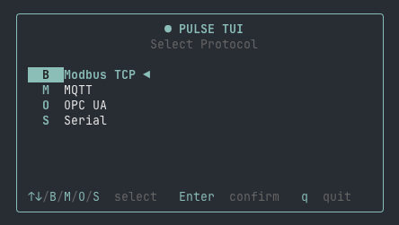

# Pulse-TUI


A real-time terminal monitor (TUI) built in Rust. Supports MQTT, Modbus TCP, OPC UA, and serial-port monitoring.



## Features

### MQTT
- Live message stream with per-topic filtering
- JSON syntax highlighting
- Message search with inline match highlighting
- Yank mode — copy message payload to clipboard (when paused)
- Subscribe / unsubscribe to topics at runtime
- Publish messages to selected topic
- Per-topic message count and TPS (messages/sec) stats
- MQTT 3.1.1 and MQTT v5 support
- Username / password authentication
- Auto-reconnect on disconnect

### Modbus TCP
- Connect to any Modbus TCP device by host, port, and unit ID
- Query registers via Function Code selector (FC01 Coil, FC02 Discrete, FC03 Holding, FC04 Input)
- Configurable start address and quantity
- Live tabular view: Address, Hex, Binary, and interpreted Display columns
- Multiple display formats: Unsigned, Signed, Hex, Binary, Long, Long Inverse, Float, Float Inverse, Double, Double Inverse
- Auto-reconnect on disconnect

### OPC UA
- Connect to OPC UA servers using an `opc.tcp://` endpoint
- Poll one or more NodeIds at a configurable interval
- View each node's display name, value, data type, and source/server timestamps
- Add and remove monitored NodeIds without reconnecting
- Anonymous access or username/password authentication

### Serial
- Connect to any serial port with configurable baud rate, data bits, parity, and stop bits
- Timestamped RX / TX log (`hh:mm:ss RX <-` / `hh:mm:ss TX ->`)
- ASCII and Hex display modes (toggle with `x`)
- Send messages in ASCII or Hex format
- Real-time hex input validation (illegal characters, odd digit count)
- Pause / resume incoming data stream
- Status bar shows line count, total bytes received, and last message byte count
- Log capped at 2000 entries

### General
- Protocol selector on launch (MQTT / Modbus TCP / OPC UA / Serial)
- Config persisted to `~/.pulse-tui.toml` (all connection settings restored on next launch)

## Install

### Install prebuilt binaries via shell script

```sh
curl --proto '=https' --tlsv1.2 -LsSf https://github.com/SShnoodles/Pulse-TUI/releases/latest/download/pulse-installer.sh | sh
```

### Install prebuilt binaries via powershell script

```sh
powershell -ExecutionPolicy Bypass -c "irm https://github.com/SShnoodles/Pulse-TUI/releases/latest/download/pulse-installer.ps1 | iex"
```

### Install prebuilt binaries via Homebrew

```sh
brew install sshnoodles/tap/pulse
```

### Build from source

Rust 1.75 or later is required. On Linux, the `serialport` dependency may also
need your distribution's `libudev` development package.

```sh
git clone https://github.com/SShnoodles/Pulse-TUI.git
cd Pulse-TUI
cargo install --path .
```

## Usage

Just run `pulse` — no arguments needed. All settings are restored from `~/.pulse-tui.toml` on launch.

```bash
pulse
```

## Key Bindings

### Protocol select

| Key | Action |
|-----|--------|
| `↑` / `↓` | Move selection |
| `Enter` | Confirm |
| `M` | Go to MQTT connect form |
| `B` | Go to Modbus TCP connect form |
| `O` | Go to OPC UA connect form |
| `S` | Go to Serial connect form |
| `q` / `Ctrl+C` | Quit |

### Connect form (MQTT, Modbus TCP, and OPC UA)

| Key | Action |
|-----|--------|
| `Tab` / `↓` | Next field |
| `Shift+Tab` / `↑` | Previous field |
| `←` / `→` / `Space` | Toggle MQTT version (on version field) |
| `Enter` | Connect |
| `Esc` | Back to protocol select |
| `Ctrl+C` | Quit |

For MQTT, `←` / `→` / `Space` changes the protocol version when the Version
field is selected. The other forms have only text fields.

### MQTT Monitor — normal mode

| Key | Action |
|-----|--------|
| `Tab` | Switch focus between Topics and Messages panels |
| `↑` / `↓` | Navigate topics or messages |
| `Space` | Pause / resume message stream |
| `/` | Enter search mode |
| `s` | Enter subscribe mode |
| `d` | Delete selected topic (Topics panel) |
| `p` | Publish to selected topic |
| `y` | Enter yank (copy) mode — only when paused |
| `Esc` | Clear topic filter / open disconnect dialog |
| `c` | Clear error bar |
| `q` / `Ctrl+C` | Quit |

### MQTT Monitor — search mode

| Key | Action |
|-----|--------|
| _type_ | Filter messages by keyword |
| `Enter` | Confirm and keep filter |
| `Esc` | Cancel and clear filter |

### MQTT Monitor — subscribe mode

| Key | Action |
|-----|--------|
| _type_ | Enter topic pattern (wildcards supported) |
| `Enter` | Subscribe |
| `Esc` | Cancel |

### MQTT Monitor — yank mode (active when paused)

| Key | Action |
|-----|--------|
| `←` / `→` | Move selection cursor |
| `y` | Copy selected text to clipboard |
| `↑` / `↓` | Move to adjacent message |
| `Esc` | Exit yank mode |

### OPC UA Monitor — normal mode

| Key | Action |
|-----|--------|
| `↑` / `↓` | Select a node |
| `a` | Add a NodeId |
| `d` | Delete the selected NodeId |
| `Esc` | Open disconnect dialog |
| `q` / `Ctrl+C` | Quit |

### OPC UA Monitor — add or delete NodeId mode

| Key | Action |
|-----|--------|
| _type_ | Enter or edit the NodeId |
| `↑` / `↓` | Select a NodeId when deleting |
| `Enter` | Add or delete the NodeId |
| `Backspace` | Delete the last character |
| `Esc` | Cancel |

### Modbus TCP Monitor — normal mode

| Key | Action |
|-----|--------|
| `e` | Open query edit form |
| `↑` / `↓` | Scroll data table |
| `c` | Clear error bar |
| `Esc` | Open disconnect dialog |
| `q` / `Ctrl+C` | Quit |

### Modbus TCP Monitor — query edit mode

| Key | Action |
|-----|--------|
| `Tab` / `↓` | Next field |
| `Shift+Tab` / `↑` | Previous field |
| `←` / `→` | Change Function Code or Display Format |
| `0–9` | Type start address or quantity |
| `Backspace` | Delete last digit |
| `Enter` | Send query |
| `Esc` | Cancel |

### Serial connect form

| Key | Action |
|-----|--------|
| `Tab` / `↓` | Next field |
| `Shift+Tab` / `↑` | Previous field |
| `←` / `→` | Change baud rate, data bits, parity, or stop bits |
| `r` | Refresh port list |
| `Enter` | Connect |
| `Esc` | Back to protocol select |
| `Ctrl+C` | Quit |

### Serial Monitor — normal mode

| Key | Action |
|-----|--------|
| `w` | Enter write (send) mode |
| `x` | Toggle ASCII / Hex display |
| `Space` | Pause / resume incoming data |
| `c` | Clear log |
| `Esc` | Open disconnect dialog |
| `q` / `Ctrl+C` | Quit |

### Serial Monitor — write mode

| Key | Action |
|-----|--------|
| _type_ | Enter message (text in ASCII mode, hex pairs in Hex mode) |
| `Enter` | Send |
| `Backspace` | Delete last character |
| `Esc` | Cancel |

## Configuration

Settings are saved automatically to `~/.pulse-tui.toml` on connect:

```toml
[mqtt]
host = "localhost"
port = 1883
username = ""
version = "v311"   # or "v5"
topics = ["sensors/#", "plc/status"]

[modbus]
host = "localhost"
port = 502
unit_id = 1
poll_interval_ms = 1000

[opcua]
endpoint_url = "opc.tcp://localhost:4840"
node_ids = ["ns=2;s=Demo.Static.Scalar.Int32"]
poll_interval_ms = 1000
username = ""

[serial]
port = "/dev/ttyUSB0"   # e.g. COM3 on Windows
baud_rate = 115200
data_bits = 8           # 5 / 6 / 7 / 8
parity = "None"         # None / Odd / Even
stop_bits = 1           # 1 / 2
```

Passwords are used only for the current connection and are not written to the
configuration file.

## Roadmap

- [x] MQTT publish from TUI
- [x] Modbus TCP source
- [x] OPC UA source
- [x] Serial source

## Tech Stack

| Crate | Purpose |
|-------|---------|
| [ratatui](https://github.com/ratatui/ratatui) | TUI framework |
| [crossterm](https://github.com/crossterm-rs/crossterm) | Terminal backend |
| [tokio](https://tokio.rs) | Async runtime |
| [rumqttc](https://github.com/bytebeamio/rumqtt) | MQTT client |
| [tokio-modbus](https://github.com/slowtec/tokio-modbus) | Modbus TCP client |
| [serialport](https://github.com/serialport/serialport-rs) | Serial port I/O |
| [async-opcua](https://github.com/locka99/opcua) | OPC UA client |
| [serde](https://serde.rs) + [toml](https://github.com/toml-rs/toml) | Config serialization |
| [arboard](https://github.com/1Password/arboard) | Clipboard access |
| [tracing](https://github.com/tokio-rs/tracing) | Logging |

## License

MIT
